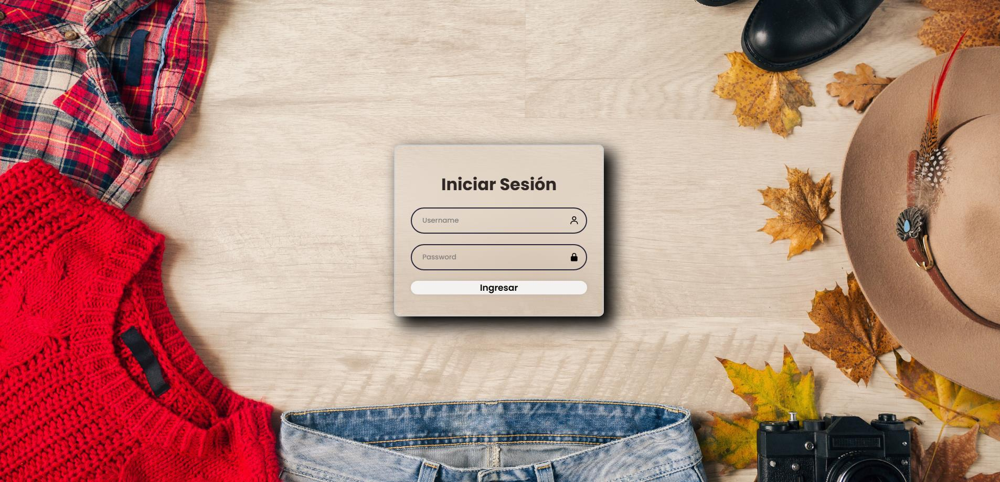
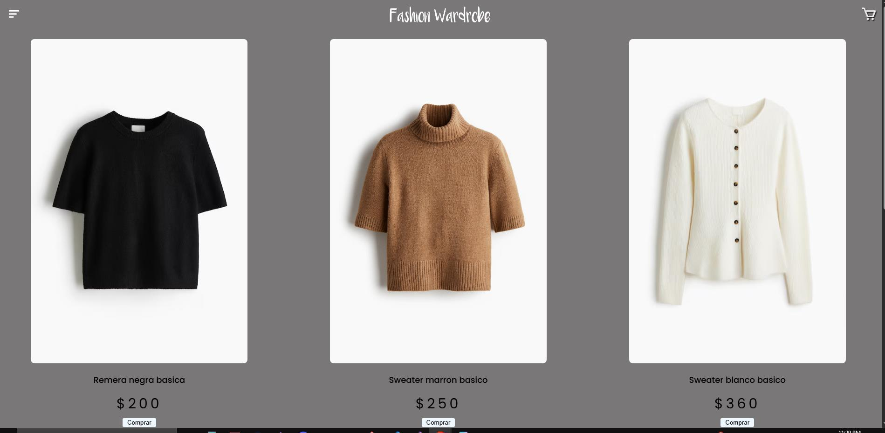
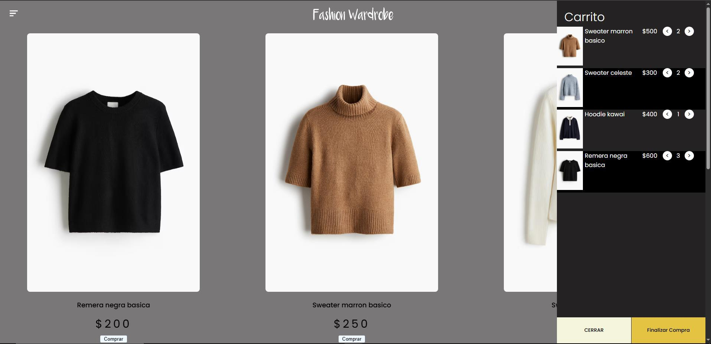

## Clothes Store

This is a final project from my Programming II class. The guidelines where to create a Responsive Web Page including: a Login, a Landing Page with a dropdown menu, a Products Page and a Cart indicating the order total.

### Login 

This is the Login wich stylized with css native and javascript only. It should have a *register* option but i didn't had time to add it.

### Landing Page

The landing page contains a extendible drowpdown menu with all the tabs availabe. An animation next to the logo of the store and a preview of the products. The burger style dropdown menu was coded with only css native and javascript. It surely would have been easier to use an element from a framework but I still didn't learned to use any.

In this tab I wanted to use a simple way to show both the products and the cart so I designed a side cart that extends from the right side when you click the cart icon. It storage the items in the local storage of the browser so you dont lose your items, it's not refined but I'll do a V2 of a Web Store using more tools and finally adding frameworks to make everything escalable and easier to read if I want to change the code.